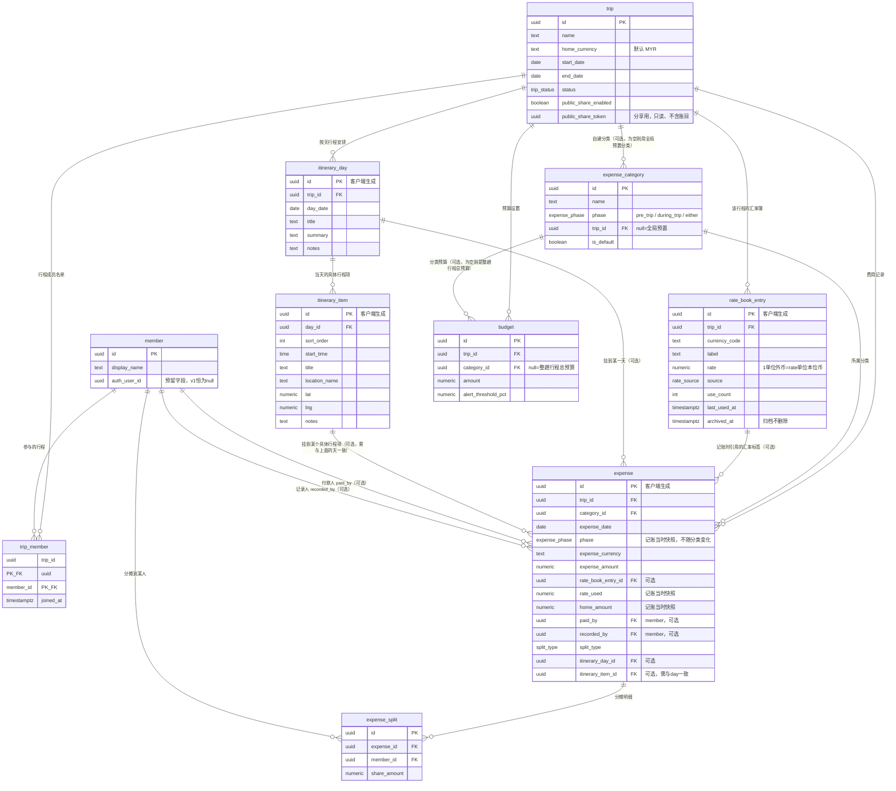

# 数据库 ER 图

对应迁移文件：[`supabase/migrations/0001_init.sql`](../../supabase/migrations/0001_init.sql)。

本图覆盖实施计划「数据模型（核心表）」章节里的全部实体：`trip`、`member`、`trip_member`、
`itinerary_day`、`itinerary_item`、`expense_category`、`rate_book_entry`、`expense`、
`expense_split`、`budget`。Dexie 本地专用的 `outbox` 表不同步到 Supabase，不在此图范围内。

## 实体关系图

## 非显而易见的关系说明

### 1. 为什么 `expense` 要把 `phase` 再存一份，而不是每次 join `expense_category.phase` 现算？

`expense_category.phase` 描述的是**分类当前**的阶段标签，这个标签以后可能被用户编辑（比如把某个
自建分类从 `during_trip` 改成 `either`）。如果 `expense` 的"出行前/途中"归属永远靠实时 join 分类表
算出来，那么用户随手改一次分类定义，**所有引用过这个分类的历史费用**都会被静默地重新归类——这正是
实施计划里明确排除的行为（"分类的 `phase` 标签、记录时快照的汇率/折算金额都是'不追溯历史'的设计"）。

所以在记账那一刻，应用层就把当时选中分类的 `phase` 值复制一份，落地存进 `expense.phase`。之后
`expense_category.phase` 怎么改，都不会影响这条历史记录的阶段归属；分类表和费用表在这一点上是
**故意解耦**的，`expense.category_id` 这个外键只负责"这笔钱属于哪个分类"，不负责"这笔钱算出行前还是
途中"。

同样的道理也适用于 `rate_used` / `home_amount`：`rate_book_entry` 上的汇率标签之后可能被编辑、
另存为新标签、或归档，但已经发生的这笔费用当时用的是哪个汇率、折算成本位币是多少钱，必须原样保留。
`expense.rate_book_entry_id` 只是"当时引用过哪个标签"的溯源信息（方便 UI 显示"这笔钱当时用的是
'信用卡汇率'标签"），真正参与后续统计计算的永远是快照下来的 `rate_used` 和 `home_amount`，不会随
汇率簿的编辑而重算。数据库层面用 `rate_book_entry_id` 的 `on delete set null`（而不是 `cascade`）
来兜底：即使有人直接物理删除了一条汇率簿记录，`expense` 行本身、以及它快照的金额也不会丢失或变得无效。

### 2. `itinerary_item.day_id` 与 `expense.itinerary_day_id` / `itinerary_item_id` 是什么关系？

`itinerary_item.day_id` 是行程结构本身的归属关系：每个具体行程项（"上午：环球影城"）必须挂在某一天
（`itinerary_day`）下面，这是行程记录模块的主干结构，`day_id` 是 `not null` 外键。

`expense.itinerary_day_id` 和 `expense.itinerary_item_id` 则是**账目模块反过来关联行程模块**的可选
挂钩，两个字段都可以为空：

- 都不填：这笔费用不挂在任何具体的天/行程项上（比如出行前买的机票、保险——那时候可能还没排好每天
  的行程）。
- 只填 `itinerary_day_id`：这笔费用挂在"某一天"，但不挂到具体某个行程项（比如"这天的餐饮总花费"）。
- 同时填了 `itinerary_item_id`：这笔费用挂到一个更具体的行程项（比如"环球影城门票"这一项本身）。
  这种情况下，`itinerary_item_id` 所属的 `day_id` **必须**和 `itinerary_day_id` 保持一致——数据库
  用一个 `before insert or update` 触发器（`fn_expense_check_item_day_consistency`）强制校验这一点：
  如果只传了 `itinerary_item_id` 没传 `itinerary_day_id`，触发器会自动把 `itinerary_day_id` 补齐成
  该行程项所属的天；如果两者都传了但不一致，直接拒绝写入并报错。之所以用触发器而不是 `check` 约束，
  是因为 Postgres 的 `check` 约束不能跨表查询 `itinerary_item` 的 `day_id`。

行程视图的"当天/该行程项花了多少钱"汇总功能，就是分别按 `itinerary_day_id`（当天汇总）和
`itinerary_item_id`（该行程项汇总）对 `expense.home_amount` 做 `sum()`，对应的两个索引
（`idx_expense_itinerary_day_id`、`idx_expense_itinerary_item_id`）就是为这个查询模式建的。

### 3. `rate_book_entry` / `itinerary_day` / `itinerary_item` / `expense` 为什么用"客户端生成 UUID 作为主键"？

这四张表都是离线记账/离线行程编辑场景下，用户在没有网络时就可能新建的记录。按照实施计划的离线同步
架构，前端在本地 Dexie 数据库里创建这些记录时，会直接生成一个 UUID 当作它的 `id`（而不是等服务器
分配自增 ID），联网后台同步引擎再用"按这个 UUID upsert"的方式把它写入 Supabase。这样无论同步失败
重试多少次，同一条本地记录最终都只会在服务器上产生一行数据，天然幂等。迁移文件里这四张表的 `id`
列仍然保留了 `default gen_random_uuid()`，只是为了给服务器端直接插入（脚本、种子数据）留一个兜底，
正常的前端离线写入路径一定会显式传入客户端生成好的 `id`。

### 4. 只读分享链接为什么在这张图里"看不出"账目被隔离？

`trip.public_share_enabled` / `public_share_token` 只是行程表上的两个字段，ER 图本身不体现"查询层
隔离"——这是应用层（`src/features/share/` 的公开路由）的职责：分享页面对应的查询只会 `select`
`itinerary_day` / `itinerary_item`，**代码里从源头就不引用** `expense` / `expense_split` /
`rate_book_entry` 等任何账目相关表，而不是查出来又在界面上隐藏。数据库层面这些表之间也没有强制的
"分享可见性"外键或视图，全部账目表的 RLS 策略都还是 v1 的 `using (true)`（无登录、全放行），账目
安全完全依赖"公开路由不查账目表"这一条应用层约定，需要配合阶段 6 的"分享链接安全测试"来验证。

## RLS 与 `member.auth_user_id` 预留钩子

迁移文件给所有表都启用了 RLS，但策略是 `using (true) / with check (true)`（即 `<表名>_allow_all_v1`），
本质上等于没有做任何权限限制——这是 v1"无需登录"设计下的正确行为，不是疏漏。`member.auth_user_id`
字段从建表第一天就存在、可为空，专门是为了未来接入 Supabase Auth 时，不需要改动表结构：只要把这个
字段填上真实的 `auth.uid()`，再把上述 permissive 策略逐个替换成类似
`using (member_id in (select id from member where auth_user_id = auth.uid()))` 的收紧版本即可。
